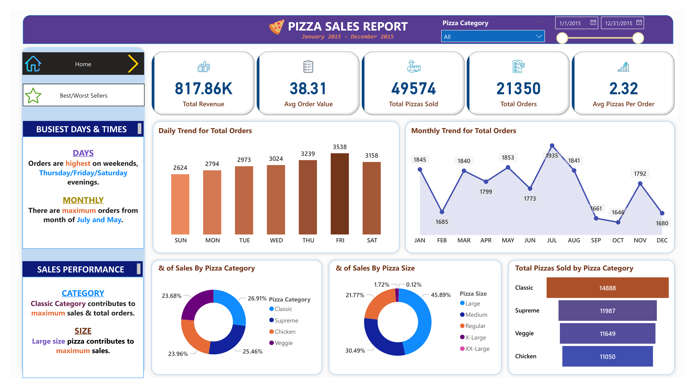
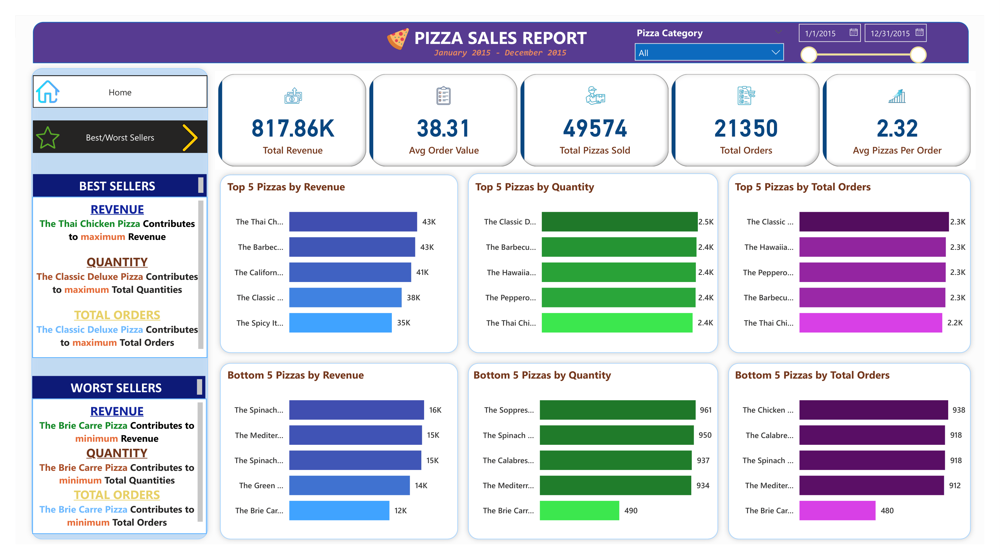

# 🍕 Pizza Sales Analysis Dashboard

> End-to-end data analytics project using **MySQL** and **Power BI** to analyze pizza sales performance, customer purchasing behavior, and product performance through interactive business intelligence dashboards.

---

# 📌 Project Overview

This project analyzes one year of pizza sales transaction data to uncover actionable business insights related to sales performance, customer purchasing behavior, product performance, and revenue trends.

The workflow combines **MySQL** for data exploration and business query analysis with **Power BI** for developing interactive dashboards that enable dynamic business monitoring and support data-driven decision-making.

---

# 🎯 Business Problem

Although the restaurant collected daily sales transactions, the data was stored across multiple tables without a centralized reporting solution. This made it difficult for management to answer key business questions such as:

- Which pizzas generate the highest revenue?
- Which products consistently underperform?
- What are the busiest ordering periods?
- Which pizza categories contribute the most revenue?
- Which pizza sizes perform best?
- How do customer purchasing patterns change over time?

To solve these challenges, an interactive dashboard was developed to transform raw transactional data into meaningful business insights.

---

# 🎯 Project Objectives

- Analyze overall sales performance.
- Evaluate customer purchasing behavior.
- Identify top and bottom-performing products.
- Analyze sales contribution by category and pizza size.
- Develop an interactive dashboard for business monitoring.

---

# 🛠️ Tools & Technologies

| Category | Tools |
|-----------|-------|
| Database | MySQL |
| Data Visualization | Power BI |
| Data Modeling | DAX |
| Data Source | Microsoft Excel |

---

# 📂 Repository Structure

```
Pizza-Sales-Analysis
│
├── README.md
│
├── 01_Data
│   ├── README.md
│   └── pizza_sales_dataset.xlsx
│
├── 02_SQL
│   ├── README.md
│   └── Pizza Sales Analysis.sql
│
├── 03_PowerBI
│   ├── README.md
│   └── Pizza Sales Analysis Dashboard.pbix
│
└── 04_Image
    ├── README.md
    ├── dashboard-home.png
    └── dashboard-product-performance.png
```

---

# 📊 Dashboard Preview

## Dashboard 1 — Sales Performance Overview



### Dashboard Description

This dashboard provides a comprehensive overview of business performance through interactive KPIs, sales trends, and category analysis.

### Key Performance Indicators

| KPI | Value |
|------|-------:|
| Total Revenue | **$817.86K** |
| Total Orders | **21,350** |
| Total Pizzas Sold | **49,574** |
| Average Order Value | **$38.31** |
| Average Pizzas per Order | **2.32** |

### Dashboard Features

- Executive KPI Cards
- Daily Sales Trend
- Monthly Sales Trend
- Revenue by Pizza Category
- Revenue by Pizza Size
- Total Quantity Sold by Category
- Interactive Date Filter
- Interactive Category Filter

### Key Business Insights

- Generated **$817.86K** in total revenue during the analysis period.
- Processed **21,350** customer orders.
- Sold **49,574** pizzas.
- Friday recorded the highest daily order volume.
- July achieved the highest monthly sales.
- The **Classic** category contributed approximately **26.91%** of total pizzas sold.
- **Large-size** pizzas generated approximately **45.89%** of total revenue.

---

## Dashboard 2 — Product Performance Analysis



### Dashboard Description

This dashboard evaluates individual pizza performance by comparing the highest and lowest-performing products across multiple business metrics.

### Dashboard Features

Top & Bottom Performance Analysis based on:

- Revenue
- Quantity Sold
- Total Orders

Interactive filters allow users to compare product performance across categories and time periods.

### Key Business Insights

- **Thai Chicken Pizza** and **Barbecue Chicken Pizza** generated the highest revenue (approximately **$43K** each).
- **Classic Deluxe Pizza** recorded the highest sales quantity and total orders.
- **Brie Carre Pizza** consistently ranked as the lowest-performing product across revenue, quantity sold, and total orders.
- The dashboard enables management to quickly identify high-performing and underperforming menu items.

---

# 🗄️ SQL Analysis

The transactional sales data was explored using **MySQL** to answer key business questions before developing the dashboard.

### SQL Techniques

- Aggregate Functions
- GROUP BY
- ORDER BY
- CASE WHEN
- Date Functions
- Ranking Functions
- Sales Aggregation

### Business Questions Answered

- What is the total revenue?
- Which pizzas generate the highest revenue?
- Which products perform the best and worst?
- Which day records the highest sales?
- Which month generates the highest revenue?
- Which pizza category contributes the most sales?
- Which pizza size generates the highest revenue?

---

# 📈 Power BI Development

The interactive dashboard was developed after completing SQL analysis.

### DAX Measures

- Total Revenue
- Total Orders
- Total Pizzas Sold
- Average Order Value
- Average Pizzas per Order

### Dashboard Capabilities

- Interactive KPI Monitoring
- Dynamic Filtering
- Product Performance Comparison
- Sales Trend Analysis
- Executive Reporting
- Business Intelligence Dashboard

---

# 💼 Business Value

This project demonstrates how MySQL and Power BI can be integrated to transform raw transactional data into an interactive reporting solution that helps businesses:

- Monitor sales performance.
- Identify growth opportunities.
- Optimize product offerings.
- Understand customer purchasing behavior.
- Support strategic decision-making through data.

---

# 🚀 Skills Demonstrated

### SQL

- Data Exploration
- Data Aggregation
- Business Query Analysis
- Ranking Functions
- Date Functions

### Power BI

- Data Modeling
- DAX
- KPI Development
- Interactive Dashboard Design
- Data Visualization

### Business Analytics

- Sales Performance Analysis
- Product Performance Analysis
- Customer Purchasing Behavior Analysis
- Trend Analysis
- Business Intelligence Reporting
