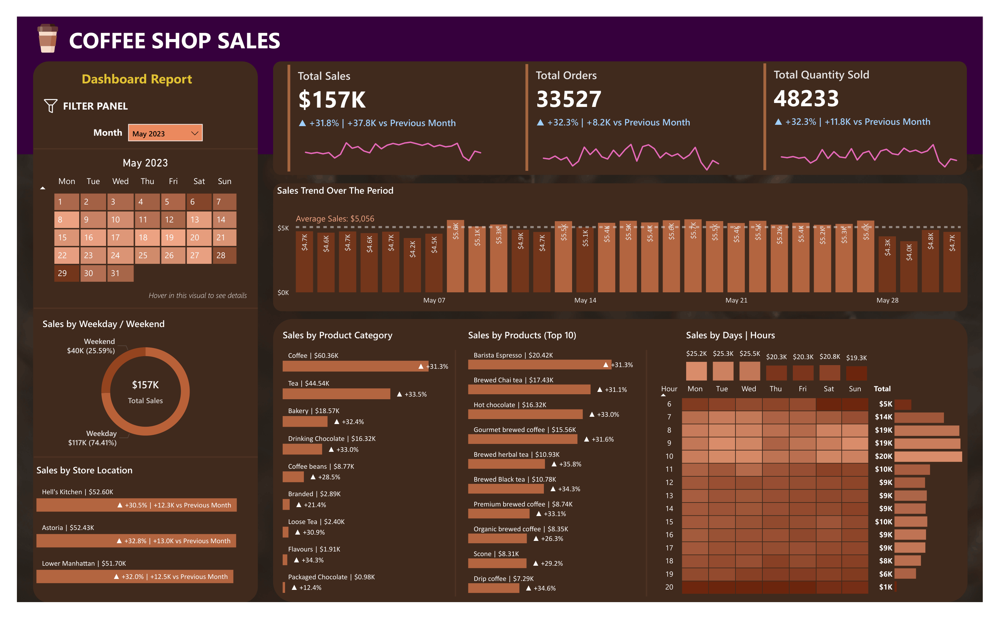

# ☕ Coffee Shop Sales Analysis Dashboard

> End-to-end data analytics project using **MySQL** and **Power BI** to analyze coffee shop sales performance, customer purchasing behavior, store performance, and sales trends through an interactive business intelligence dashboard.

---

# 📌 Project Overview

This project analyzes transactional sales data from a coffee shop chain to uncover actionable business insights related to sales performance, customer purchasing behavior, product performance, store performance, and sales trends.

The project integrates **MySQL** for data cleaning, transformation, and exploratory analysis with **Power BI** for building an interactive dashboard that supports business monitoring and data-driven decision-making.

---

# 🎯 Business Problem

The coffee shop management required a centralized reporting solution to monitor sales performance, customer purchasing behavior, and product demand across multiple store locations. Transactional data was dispersed across several tables, making it difficult to evaluate sales trends, identify top-performing products, compare store performance, and understand peak business hours for operational and marketing decisions.

---

# 🎯 Project Objectives

- Analyze overall sales performance.
- Monitor sales trends over time.
- Evaluate product category performance.
- Identify best-selling products.
- Compare sales across store locations.
- Analyze weekday vs weekend sales.
- Identify peak business hours.
- Develop an interactive business intelligence dashboard.

---

# 🛠️ Tools & Technologies

| Category | Tools |
|-----------|-------|
| Database | MySQL |
| Data Visualization | Power BI |
| Data Modeling | DAX |
| Data Source | Microsoft Excel |

---

# 📂 Repository Structure

```text
02_Coffee-Shop-Sales-Analysis
│
├── README.md
│
├── 01_Data
│   ├── README.md
│   └── coffee_shop_sales_dataset.xlsx
│
├── 02_SQL
│   ├── README.md
│   └── Coffee Shop Sales Project.sql
│
├── 03_PowerBI
│   ├── README.md
│   └── Coffee Shop Sales Analysis Dashboard.pbix
│
└── 04_Image
    ├── README.md
    └── dashboard-overview.png
```

---

# 📊 Dashboard Preview

## Coffee Shop Sales Dashboard



### Dashboard Description

This dashboard provides a comprehensive overview of coffee shop sales performance through interactive KPIs, sales trends, product analysis, store performance, and customer purchasing behavior.

---

### Executive KPIs

| KPI | Value |
|------|-------:|
| Total Sales | **$157K** |
| Total Orders | **33,527** |
| Total Quantity Sold | **48,233** |

---

### Dashboard Features

- Executive KPI Cards
- Daily Sales Trend
- Product Category Performance
- Top 10 Best-Selling Products
- Store Location Performance
- Weekday vs Weekend Sales Comparison
- Sales Distribution by Day & Hour (Heatmap)
- Interactive Month Filter

---

### Key Business Insights

- Generated **$157K** in total sales from **33,527** customer orders and **48,233** products sold.
- Coffee was the highest-performing product category, contributing more than **$60K** in total sales.
- Barista Espresso ranked as the best-selling individual product.
- Weekday sales accounted for approximately **74%** of total revenue, significantly outperforming weekend sales.
- Hell's Kitchen and Astoria were identified as the highest-performing store locations based on total sales.
- The sales heatmap revealed peak business hours, providing valuable insights for staffing, inventory planning, and promotional activities.

---

# 🗄️ SQL Analysis

The transactional sales data was explored using MySQL to answer key business questions before developing the Power BI dashboard.

## SQL Techniques

- Data Cleaning & Data Type Conversion
- Aggregate Functions (SUM, COUNT, AVG)
- GROUP BY
- ORDER BY
- CASE WHEN
- Date Functions
- Business KPI Calculation
- Product Performance Analysis
- Store Performance Analysis
- Time-based Sales Analysis

---

## Business Questions Answered

- What is the overall sales performance?
- How much total sales revenue was generated?
- How many customer orders and products were sold?
- Which product categories generate the highest sales?
- Which products are the best-selling items?
- Which store locations perform the best?
- How do weekday and weekend sales compare?
- What are the busiest business hours?
- How do monthly sales trends change over time?

---

# 📈 Power BI Dashboard

The interactive Power BI dashboard transforms SQL analysis into an executive reporting solution for monitoring business performance.

## Dashboard Capabilities

- Executive KPI Monitoring
- Monthly Sales Tracking
- Product Category Analysis
- Product Performance Analysis
- Store Location Comparison
- Weekday vs Weekend Analysis
- Hourly Sales Heatmap
- Interactive Filtering
- Dynamic Business Reporting

---

## DAX Measures

The dashboard includes several DAX measures to calculate key business metrics, including:

- Total Sales
- Total Orders
- Total Quantity Sold
- Previous Month Sales
- Month-over-Month (MoM) Growth

---

# 💼 Business Value

This project demonstrates how SQL and Power BI can be integrated to transform raw transactional data into an interactive reporting solution that enables stakeholders to:

- Monitor overall business performance.
- Identify top-performing products and store locations.
- Understand customer purchasing behavior.
- Optimize staffing and inventory management.
- Support strategic business decisions through data-driven insights.

---

# 🚀 Skills Demonstrated

### SQL

- Data Cleaning
- Data Transformation
- Business Query Analysis
- Aggregate Functions
- Time-based Analysis

### Power BI

- Data Modeling
- DAX
- Interactive Dashboard Design
- KPI Development
- Data Visualization

### Business Analytics

- Sales Performance Analysis
- Product Performance Analysis
- Store Performance Analysis
- Customer Purchasing Behavior Analysis
- Time Series Analysis
