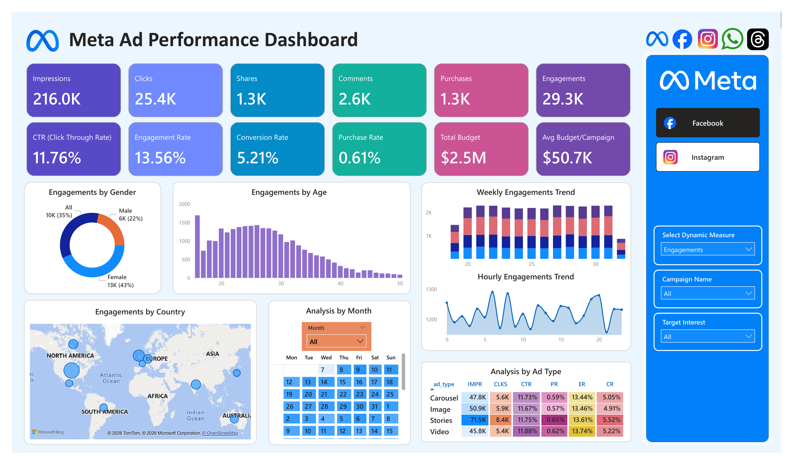
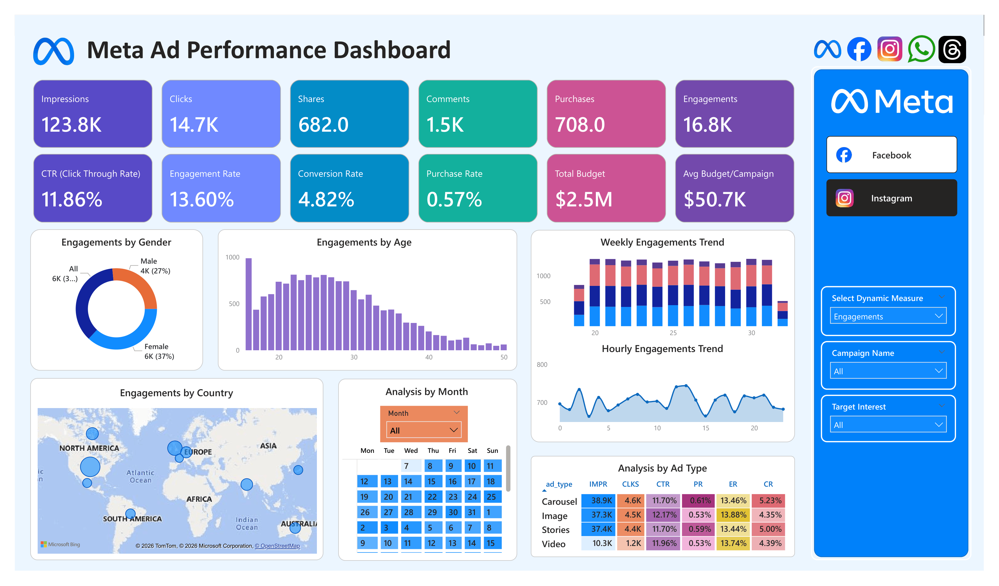

# 📱 Meta Ad Performance Analysis Dashboard

> End-to-end marketing analytics project using **Power BI** to analyze Facebook and Instagram advertising performance, audience behavior, campaign effectiveness, and marketing KPIs through interactive dashboards.

---

# 📌 Project Overview

This project analyzes Meta advertising campaign performance across Facebook and Instagram using interactive Power BI dashboards.

The dashboards monitor campaign performance, audience demographics, engagement trends, advertisement effectiveness, and conversion metrics to support marketing optimization and data-driven decision-making.

---

# 🎯 Business Problem

Marketing teams often manage multiple advertising campaigns across different Meta platforms, making it difficult to evaluate campaign effectiveness, compare platform performance, understand audience behavior, and optimize marketing budgets.

This project centralizes campaign data into interactive dashboards that provide actionable insights into advertising performance and audience engagement.

---

# 🎯 Project Objectives

- Monitor advertising KPIs.
- Compare Facebook and Instagram campaign performance.
- Analyze audience demographics.
- Evaluate advertisement effectiveness.
- Identify high-performing audience segments.
- Support campaign optimization through interactive dashboards.

---

# 🛠️ Tools & Technologies

| Category | Tools |
|-----------|-------|
| Data Visualization | Power BI |
| Data Preparation | Power Query |
| Data Modeling | DAX |
| Data Source | Microsoft Excel |

---

# 📂 Repository Structure

```text
03_Meta-Ad-Performance Dashboard
│
├── README.md
│
├── 01_Data
│   ├── README.md
│   ├── ad_events.xlsx
│   ├── ads.xlsx
│   ├── campaigns.xlsx
│   └── users.xlsx
│
├── 02_PowerBI
│   ├── README.md
│   └── Meta Ad Performance Dashboard.pbix
│
└── 03_Image
    ├── README.md
    ├── facebook-dashboard.png
    └── instagram-dashboard.png
```

---

# 📊 Dashboard Preview

## Dashboard 1 — Facebook Ads Performance



### Dashboard Description

This dashboard provides a comprehensive overview of Facebook advertising performance through campaign KPIs, audience demographics, engagement metrics, and advertisement effectiveness.

---

### Executive KPIs

| KPI | Value |
|------|-------:|
| Impressions | **216K** |
| Clicks | **25.4K** |
| Purchases | **1.3K** |
| CTR | **11.76%** |
| Engagement Rate | **13.56%** |
| Conversion Rate | **5.21%** |

---

### Dashboard Features

- Executive KPI Cards
- Audience Demographics
- Engagement by Gender
- Engagement by Age Group
- Weekly Engagement Trend
- Country Performance
- Monthly Campaign Analysis
- Advertisement Type Performance
- Hourly Engagement Trend
- Day & Hour Heatmap
- Interactive Campaign Filters

---

### Key Insights

- Generated **216K impressions**, **25.4K clicks**, and **1.3K purchases**.
- Female audiences contributed the highest engagement.
- Users aged **20–30** represented the most active audience segment.
- Stories achieved the highest Conversion Rate.
- Video advertisements produced the highest Engagement Rate.

---

## Dashboard 2 — Instagram Ads Performance



### Dashboard Description

This dashboard analyzes Instagram advertising campaigns by evaluating audience engagement, campaign performance, demographic characteristics, and advertisement effectiveness.

---

### Executive KPIs

| KPI | Value |
|------|-------:|
| Impressions | **123.8K** |
| Clicks | **14.7K** |
| Purchases | **708** |
| CTR | **11.86%** |
| Engagement Rate | **13.60%** |
| Conversion Rate | **4.82%** |

---

### Dashboard Features

- Executive KPI Cards
- Audience Demographics
- Engagement by Gender
- Engagement by Age Group
- Weekly Engagement Trend
- Country Performance
- Monthly Campaign Analysis
- Advertisement Type Performance
- Hourly Engagement Trend
- Day & Hour Heatmap
- Interactive Campaign Filters

---

### Key Insights

- Generated **123.8K impressions**, **14.7K clicks**, and **708 purchases**.
- Female users consistently generated the highest engagement.
- Users aged **20–30** remained the primary target audience.
- Carousel advertisements achieved the highest Conversion Rate.
- Image advertisements produced the highest Engagement Rate.

---

# 📈 Power BI Dashboard

The dashboard transforms marketing campaign data into an interactive reporting solution for evaluating advertising performance across Meta platforms.

---

## Dashboard Capabilities

- Executive KPI Monitoring
- Campaign Performance Analysis
- Audience Demographics Analysis
- Advertisement Effectiveness Analysis
- Weekly Engagement Tracking
- Country Performance Analysis
- Day & Hour Engagement Heatmap
- Interactive Filtering
- Dynamic Business Reporting

---

## DAX Measures

The dashboard includes several DAX measures to calculate marketing KPIs, including:

- Impressions
- Clicks
- Purchases
- CTR (Click-Through Rate)
- Engagement Rate
- Conversion Rate
- Purchase Rate
- Total Budget
- Return on Advertising Spend (ROAS)

---

# 💼 Business Value

This dashboard enables marketing teams to:

- Monitor campaign performance.
- Compare Facebook and Instagram advertising results.
- Understand audience behavior.
- Optimize campaign targeting.
- Improve advertising effectiveness.
- Support marketing budget allocation using data-driven insights.

---

# 🚀 Skills Demonstrated

### Power BI

- Data Modeling
- DAX
- Interactive Dashboard Design
- KPI Development
- Data Visualization

### Marketing Analytics

- Campaign Performance Analysis
- Audience Segmentation
- Advertisement Effectiveness
- Engagement Analysis
- Conversion Analysis

### Business Analytics

- Marketing KPI Monitoring
- Customer Behavior Analysis
- Trend Analysis
- Performance Reporting
- Business Intelligence
