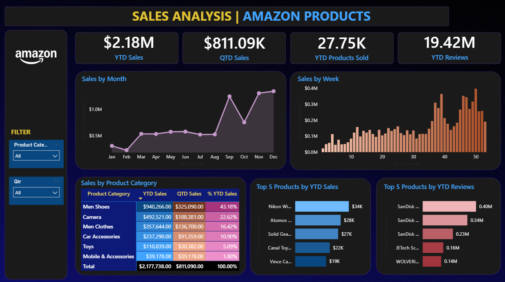

# 📊 Amazon Product Sales Analysis using Power BI

## 📌 Project Overview

This project analyzes Amazon product sales performance using Power BI to provide comprehensive insights into sales trends, customer engagement, and product performance. The dashboard enables stakeholders to monitor business KPIs, identify top-performing products, evaluate customer reviews, and support data-driven business decisions.

---

# 🎯 Business Problem

Amazon offers thousands of products across multiple categories, making it difficult to monitor sales performance, customer engagement, and product demand efficiently. Business stakeholders require an interactive reporting solution to analyze sales trends, identify top-performing products, evaluate customer reviews, and understand category-level contributions to overall revenue.

---

# 📊 Dashboard Preview

## Sales Performance Dashboard



The dashboard provides an overview of Amazon sales performance through interactive KPI cards, trend analysis, category comparison, and product ranking visualizations.

---

# 🚀 Project Objectives

- Analyze Year-to-Date (YTD) and Quarter-to-Date (QTD) sales performance.
- Evaluate customer engagement through product reviews.
- Identify top-performing product categories.
- Discover the best-selling products.
- Support business decisions through interactive dashboards.

---

# 📈 Dashboard Features

### KPI Monitoring

- YTD Sales
- QTD Sales
- YTD Products Sold
- YTD Customer Reviews

### Sales Analysis

- Monthly Sales Trend
- Weekly Sales Trend
- Sales by Product Category

### Product Performance

- Top 5 Products by Sales
- Top 5 Products by Reviews

### Interactive Filters

- Product Category
- Quarter Selection

---

# 🔍 Key Business Insights

- Generated **$2.18M** in YTD Sales.
- Achieved **$811.09K** in Quarter-to-Date Sales.
- Sold approximately **27.75K** products.
- Generated over **19.42M** customer reviews.
- Men Shoes contributed the highest sales among all product categories.
- Nikon Cameras, Atomos, and Solid Gear were among the best-selling products.
- Sandisk products consistently ranked among the highest-reviewed products.

---

# 🛠️ Tools & Technologies

| Category | Tools |
|-----------|-------|
| Data Visualization | Power BI |
| Data Modeling | DAX |
| Data Source | Microsoft Excel |

---

# 📁 Repository Structure

```text
04_Amazon-Sales-Analysis
│
├── README.md
│
├── 01_Data
│   ├── README.md
│   └── amazon_sales_dataset.xlsx
│
├── 02_PowerBI
│   ├── README.md
│   └── Amazon Sales Analysis Dashboard.pbix
│
└── 03_Image
    ├── README.md
    └── dashboard-overview.png
```
