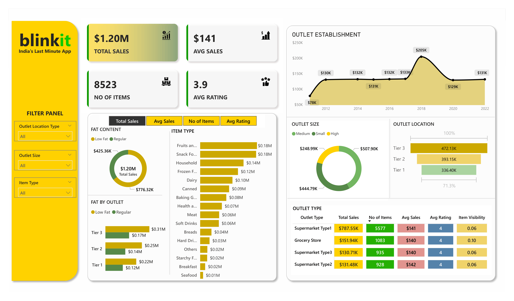

# 📊 BlinkIT Sales Performance Analysis using Power BI

## 📌 Project Overview

This project analyzes BlinkIT retail sales performance using Power BI to provide business insights across outlet locations, outlet sizes, product categories, and customer ratings. The interactive dashboard enables stakeholders to monitor key performance indicators, evaluate outlet performance, identify high-performing product categories, and support data-driven business decisions.

---

# 🎯 Business Problem

BlinkIT operates numerous retail outlets with different outlet sizes, establishment years, and product categories. As transaction volumes continue to grow, stakeholders require a centralized reporting solution to monitor sales performance, identify top-performing outlets, evaluate customer purchasing behavior, and understand category-level contributions to revenue.

This project transforms raw retail sales data into an interactive dashboard that simplifies business monitoring and supports strategic decision-making.

---

# 📊 Dashboard Preview

## BlinkIT Sales Dashboard



The dashboard provides a comprehensive overview of retail sales performance through KPI cards, outlet analysis, category performance, and interactive filtering capabilities.

---

# 🚀 Project Objectives

- Monitor overall retail sales performance.
- Analyze outlet performance by size, type, and establishment year.
- Identify top-performing product categories.
- Evaluate customer purchasing behavior and average ratings.
- Support business decision-making through interactive reporting.

---

# 📈 Dashboard Features

### KPI Monitoring

- Total Sales
- Average Sales
- Number of Items Sold
- Average Rating

### Sales Analysis

- Sales by Outlet Establishment Year
- Sales by Item Category
- Sales by Outlet Size
- Sales by Outlet Location Tier

### Outlet Performance

- Sales by Outlet Type
- Outlet Visibility
- Average Sales
- Number of Items
- Average Ratings

### Interactive Filters

- Outlet Location Type
- Outlet Size
- Item Type

---

# 🔍 Key Business Insights

- Generated approximately **$1.20M** in total sales.
- Sold **8,523** products during the reporting period.
- Achieved an average sales value of **$141** per transaction.
- Recorded an average customer rating of **3.9**.
- Tier 3 outlets generated the highest sales contribution, contributing approximately **$472K**.
- Medium-sized outlets contributed the largest share of total revenue.
- Fruits & Vegetables and Snack Foods were the highest-performing product categories, each contributing approximately **$0.18M** in sales.

---

# 🛠️ Tools & Technologies

| Category | Tools |
|-----------|-------|
| Data Visualization | Power BI |
| Data Modeling | DAX |
| Data Preparation | Power Query |
| Data Source | Microsoft Excel |

---

# 📂 Repository Structure

```text
05_BlinkIT-Sales-Analysis
│
├── README.md
│
├── 01_Data
│   ├── README.md
│   └── blinkit_sales_dataset.xlsx
│
├── 02_PowerBI
│   ├── README.md
│   └── BlinkIT Sales Analysis Dashboard.pbix
│
└── 03_Image
    ├── README.md
    └── blinkit-dashboard.png
```
