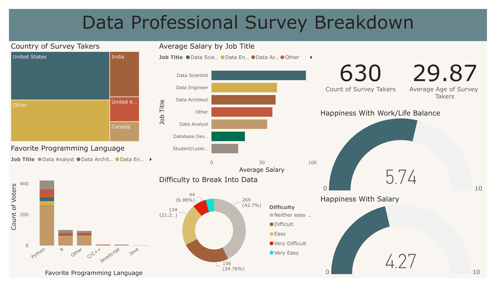

# 📊 Data Professional Survey Analysis using Power BI

## 📌 Project Overview

This project analyzes survey responses from data professionals worldwide using Power BI to uncover insights into salary trends, career satisfaction, programming language preferences, work-life balance, and industry entry challenges. The interactive dashboard provides stakeholders with a comprehensive overview of career patterns within the data industry.

---

# 🎯 Business Problem

As careers in data continue to grow rapidly, understanding salary expectations, skill preferences, career satisfaction, and work-life balance has become increasingly valuable for students, professionals, recruiters, and organizations. However, survey responses are often spread across multiple variables, making it difficult to identify meaningful trends and comparisons.

This project transforms raw survey data into an interactive Power BI dashboard that enables users to explore career insights through dynamic visualizations and business intelligence reporting.

---

# 📊 Dashboard Preview

## Data Professional Survey Dashboard



The dashboard summarizes demographic information, salary comparisons, programming language preferences, career satisfaction, and work-life balance among data professionals worldwide.

---

# 🚀 Project Objectives

- Analyze demographic distribution of survey respondents.
- Compare average salaries across different job titles.
- Identify the most popular programming languages.
- Evaluate work-life balance and salary satisfaction.
- Understand the perceived difficulty of entering the data industry.
- Present survey findings through an interactive dashboard.

---

# 📈 Dashboard Features

### KPI Monitoring

- Total Survey Respondents
- Average Respondent Age

### Career Analysis

- Average Salary by Job Title
- Favorite Programming Language
- Country Distribution

### Satisfaction Analysis

- Work-Life Balance Satisfaction
- Salary Satisfaction
- Difficulty of Entering the Data Industry

### Interactive Visualizations

- Country Comparison
- Programming Language Distribution
- Salary Comparison
- Career Satisfaction Metrics

---

# 🔍 Key Business Insights

- Analyzed responses from **630** data professionals.
- Average respondent age was **29.87 years**.
- Data Scientists reported the highest average salary, followed by Data Engineers and Data Architects.
- Python was identified as the most preferred programming language among respondents.
- Most respondents considered entering the data industry moderately difficult.
- Average Work-Life Balance Satisfaction reached **5.74/10**.
- Average Salary Satisfaction scored **4.27/10**, suggesting compensation remains a concern for many professionals.

---

# 🛠️ Tools & Technologies

| Category | Tools |
|-----------|-------|
| Data Visualization | Power BI |
| Data Modeling | DAX |
| Data Preparation | Power Query |
| Data Source | Microsoft Excel |

---

# 📂 Repository Structure

```text
06_Data-Professional-Survey-Analysis
│
├── README.md
│
├── 01_Data
│   ├── README.md
│   └── data_professional_survey_dataset.xlsx
│
├── 02_PowerBI
│   ├── README.md
│   └── Data Professional Survey Analysis Dashboard.pbix
│
└── 03_Image
    ├── README.md
    └── data-professional-survey-dashboard.png
```
