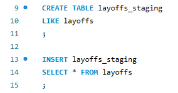
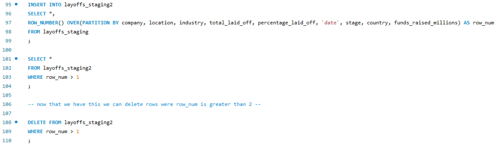
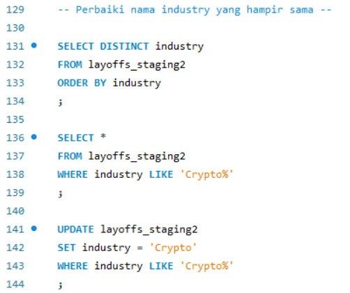
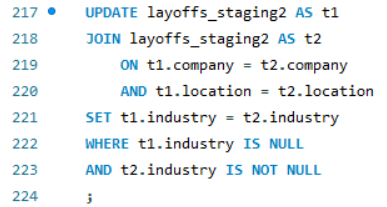
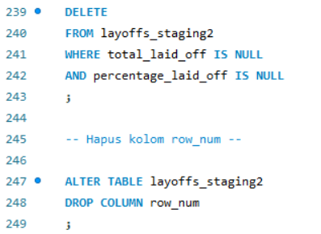
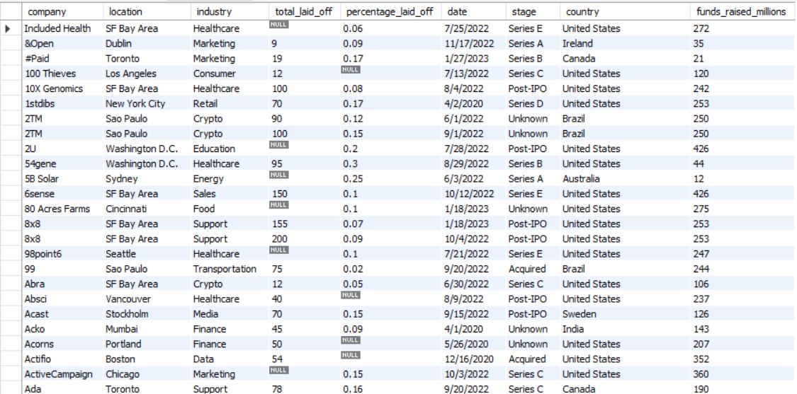

# 🧹 SQL Data Cleaning Project

## 📌 Project Overview

This project demonstrates a complete SQL data cleaning workflow using MySQL. The objective is to transform a raw layoffs dataset into a clean, standardized, and analysis-ready dataset by applying industry-standard data preparation techniques.

The project covers duplicate removal, data standardization, missing value handling, and structural cleanup while preserving the integrity of the original dataset through the use of staging tables.

---

## 🎯 Objectives

- Preserve the original dataset before cleaning
- Detect and remove duplicate records
- Standardize inconsistent text values
- Handle missing values using existing information
- Remove invalid and unnecessary records
- Produce a clean dataset ready for analysis

---

## 📂 Repository Structure

```
SQL-Data-Cleaning-Layoffs
│
├── README.md
│
├── 01_Data
│   ├── layoffs.xlsx
│   └── README.md
│
├── 02_SQL
│   ├── Data Cleaning Project.sql
│   └── README.md
│
└── 03_Image
    ├── README.md
    ├── 01-create-staging-table.png
    ├── 02-remove-duplicates.png
    ├── 03-standardize-data.png
    ├── 04-handle-missing-values.png
    ├── 05-remove-unnecessary-records.png
    └── 06-final-clean-dataset.png
```

---

# 📊 SQL Data Cleaning Workflow

## 1️⃣ Create Staging Table

To ensure the raw dataset remains unchanged, a staging table is created as a working copy before any data cleaning operations are performed.



---

## 2️⃣ Remove Duplicate Records

Duplicate records are identified using the `ROW_NUMBER()` window function and removed while preserving valid observations.



---

## 3️⃣ Standardize Data

Inconsistent values are standardized by:

- Trimming leading and trailing spaces
- Correcting inconsistent category names
- Standardizing country names
- Formatting text values



---

## 4️⃣ Handle Missing Values

Missing values are completed by referencing existing records with matching company and location information.

This improves dataset completeness without introducing incorrect values.



---

## 5️⃣ Remove Unnecessary Records

Rows containing insufficient information are removed, followed by deleting temporary helper columns created during the cleaning process.



---

## 6️⃣ Final Clean Dataset

After completing all cleaning steps, the dataset becomes structured, standardized, and ready for exploratory data analysis or business intelligence reporting.



---

# 🛠 SQL Techniques Used

- Common Table Expressions (CTE)
- Window Functions
- ROW_NUMBER()
- CREATE TABLE
- INSERT INTO
- DELETE
- UPDATE
- ALTER TABLE
- TRIM()
- REPLACE()
- CASE WHEN
- NULL Handling
- Date Formatting
- Data Standardization
- Duplicate Detection
- Data Validation

---

# 💡 Key Learning Outcomes

Through this project, the following SQL data preparation skills were demonstrated:

- Designing a safe data cleaning workflow using staging tables
- Detecting and removing duplicate records
- Standardizing inconsistent categorical values
- Handling missing values through relational updates
- Removing invalid observations
- Preparing datasets for downstream analytics
- Writing clean, structured, and maintainable SQL scripts

---

# 🚀 Tools Used

- MySQL
