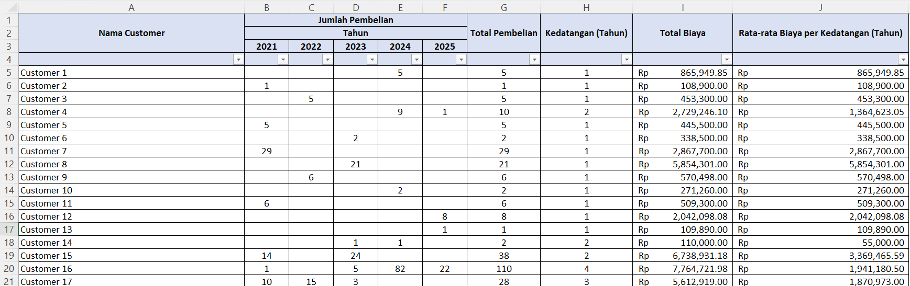
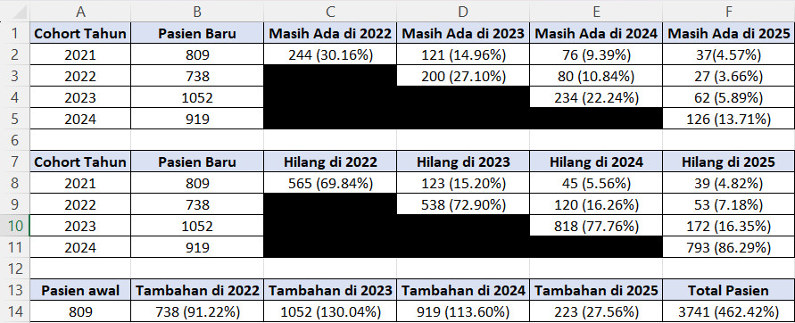
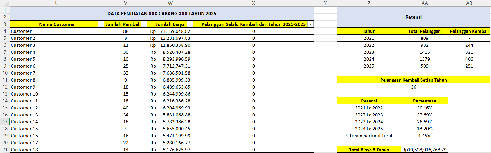
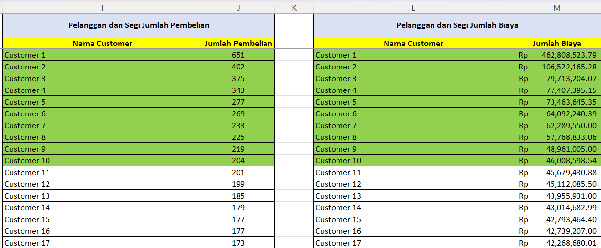
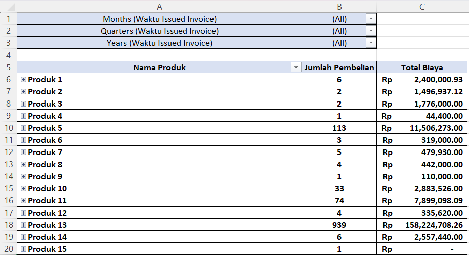
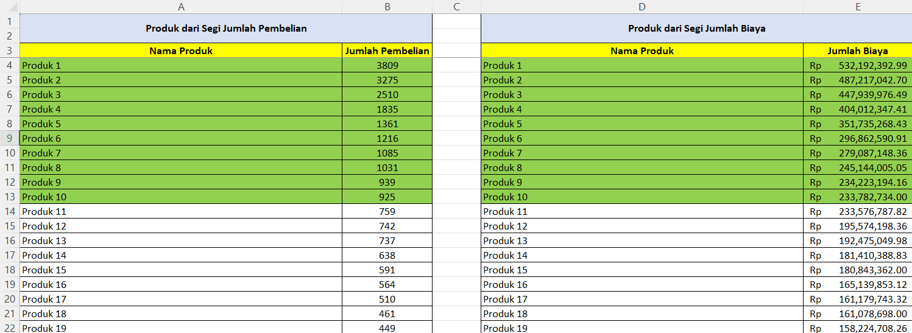

# 📊 Business Report Preview

This folder contains screenshots of the key business reports developed using **Microsoft Excel**. The reports provide comprehensive insights into customer behavior, customer retention, and product sales performance to support business monitoring and data-driven decision-making.

> **Note:** All confidential customer information has been anonymized or removed to maintain data privacy.

---

# 📊 Customer Summary

The Customer Summary report provides an overview of customer activity, including customer growth and purchasing trends across multiple years. This report helps monitor overall customer performance and supports strategic business planning.

---

# 📊 Cohort Analysis

The Cohort Analysis groups customers based on their first purchase period, allowing the business to evaluate customer retention behavior over time. This analysis helps identify long-term customer engagement and purchasing patterns.

---

# 📊 Customer Retention Analysis

The Customer Retention Analysis evaluates customer loyalty by measuring repeat purchases and retention performance across multiple years. The report supports customer relationship management and retention strategy evaluation.

---

# 📊 Top Customers

This report identifies the highest-value customers based on purchasing activity. It helps the business recognize loyal customers and prioritize customer relationship management initiatives.

---

# 📊 Product Sales Summary

The Product Sales Summary provides an overview of product and treatment sales performance. The report highlights revenue contribution, purchasing trends, and overall product performance.

---

# 📊 Top Products

This report highlights the best-performing products based on sales performance. It supports product evaluation, inventory planning, and business decision-making.

---

# 🎯 Project Objectives

- Develop comprehensive business reports using Microsoft Excel.
- Analyze customer growth and purchasing trends over multiple years.
- Evaluate customer retention and repeat purchase behavior.
- Perform cohort analysis to understand long-term customer engagement.
- Identify high-value customers based on purchasing activity.
- Analyze product and treatment sales performance.
- Generate actionable business insights to support data-driven decision-making.

---

# 📈 Excel & Analytical Skills Demonstrated

## 🛠️ Microsoft Excel Skills

- Pivot Tables
- VLOOKUP
- SUM
- SUMIF
- COUNT
- COUNTA
- IF
- IFERROR
- Data Filtering
- Data Sorting
- Data Validation
- Cell Referencing
- Multi-sheet Data Management
- Business Report Development

### 📊 Business Analytics Skills

- Customer Analytics
- Customer Retention Analysis
- Cohort Analysis
- Customer Segmentation
- Product Sales Analysis
- Revenue Analysis
- Top Customer Identification
- Product Performance Evaluation
- Business Reporting
- Business Performance Monitoring
- Data-Driven Decision Making

---

# 🚀 Business Value

These business reports demonstrate how Microsoft Excel can be utilized to transform raw operational data into meaningful business insights. Through customer reporting, retention analysis, cohort analysis, and product sales evaluation, the reports enable stakeholders to monitor business performance, identify customer behavior patterns, evaluate product performance, and support data-driven decision-making.
