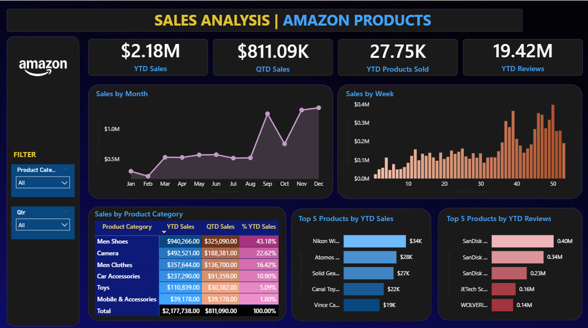

# Amazon Sales Analysis Dashboard

## Overview

This project presents an interactive Power BI dashboard to analyze Amazon sales performance. The dashboard provides insights into sales trends, product performance, and customer reviews to support data-driven business decisions.

## Dashboard Preview

## Tools

- Power BI
- DAX
- Microsoft Excel

## Dashboard Features

- Sales Performance Overview
- Product & Category Analysis
- Customer Reviews Analysis
- Interactive Filters

## Files

- Amazon Sales Analysis.pbix
- amazon-dashboard.png
