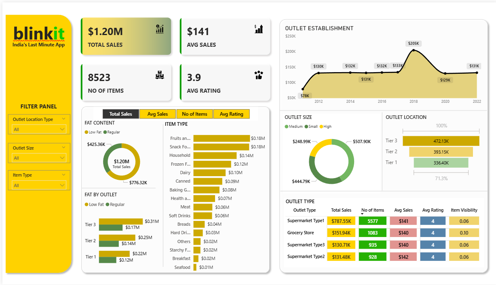

# BlinkIT Sales Analysis Dashboard

## Overview

This project presents an interactive Power BI dashboard to analyze BlinkIT grocery sales performance. The dashboard provides insights into sales trends, product performance, and customer ratings to support data-driven business decisions.

## Dashboard Preview

## Tools

- Power BI
- DAX
- Microsoft Excel

## Dashboard Features

- Total Sales KPI
- Average Sales
- Number of Items
- Average Rating
- Interactive Filters

## Files

- BlinkIT Sales Analysis.pbix
- blinkit-dashboard.png
