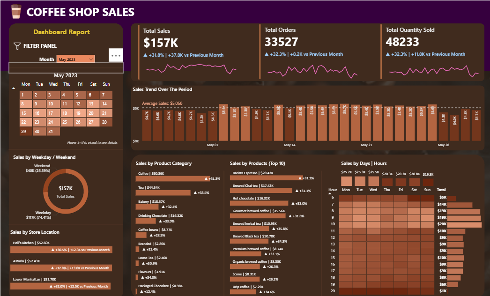

# Coffee Shop Sales Analysis Dashboard

## Overview

This project presents an interactive Power BI dashboard to analyze coffee shop sales performance. The dashboard provides insights into sales trends, product performance, customer purchasing patterns, and peak business hours to support data-driven decision making.

## Dashboard Preview

## Tools

- Power BI
- DAX
- Microsoft Excel

## Dashboard Features

- Sales Performance Overview
- Product Sales Analysis
- Calendar & Time Analysis
- Peak Hour Analysis
- Interactive Filters

## Files

- Coffee Shop Sales Analysis.pbix
- coffee-shop-dashboard.png
