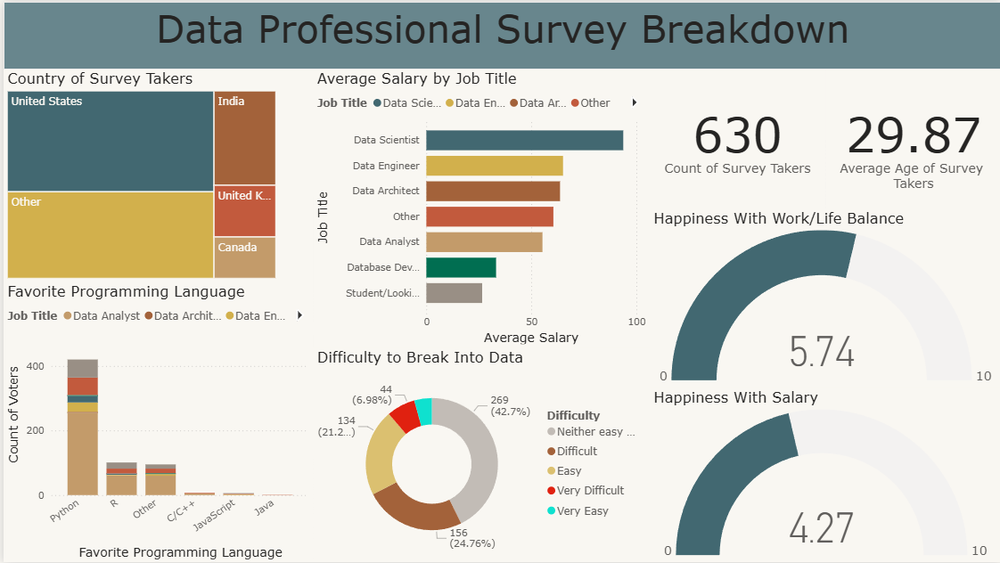

# Data Professional Survey Analysis Dashboard

## Overview

This project presents an interactive Power BI dashboard to analyze survey data from data professionals. The dashboard provides insights into salaries, job roles, programming languages, work satisfaction, and career trends to support data-driven analysis.

## Dashboard Preview

## Tools

- Power BI
- DAX
- Microsoft Excel

## Dashboard Features

- Survey Overview
- Salary Analysis
- Job Role Distribution
- Programming Language Preferences
- Work Satisfaction Analysis
- Interactive Filters

## Files

- Data Professional Survey Analysis Dashboard.pbix
- data-professional-survey-dashboard.png
