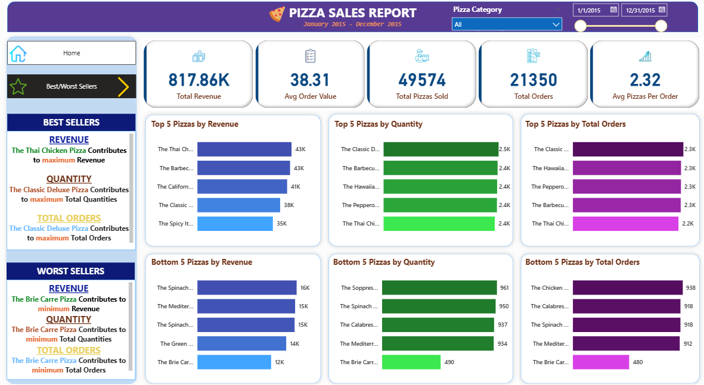

# Pizza Sales Analysis Dashboard

## Overview

This project presents an interactive Power BI dashboard to analyze pizza sales performance. The dashboard helps monitor key business metrics, identify best and worst-selling products, and support data-driven decision making.

## Dashboard Preview

## Tools

- Power BI
- DAX
- Microsoft Excel

## Dashboard Features

- Sales Performance Overview
- Revenue & Orders KPI
- Best & Worst Sellers Analysis
- Interactive Filters

## Files

- Pizza Sales Analysis.pbix
- pizza-dashboard.png
